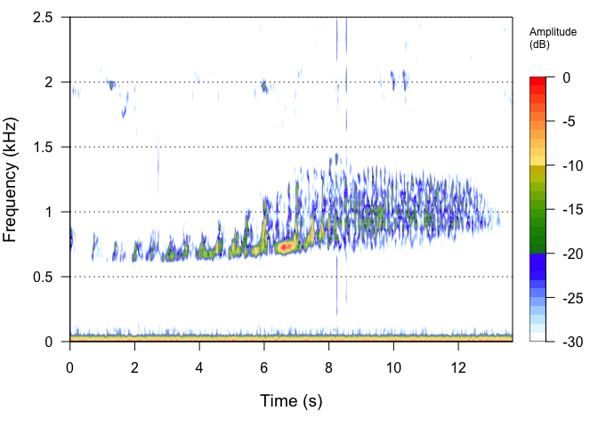

<!-- README.md is generated from README.Rmd. Please edit that file -->

# Analytical-approaches-for-acoustic-data-2023

<!-- badges: start -->
<!-- badges: end -->

## This is the GitHub repository for the Analytical Approaches for Acoustic Data Lab for the NTRES 3150 Intro Conservation Bioacoustics Fall 2023 course.

### This repository contains three R scripts:

Part 1. Exploratory analysis of different sound classes.R

Part 2. Biodiversity in different landuse types in Borneo.R

Part 3. Design your own study in sapsucker woods.R

### And one RMarkdown template to answer questions related to the lab exercises:

Analytical approaches for acoustic data lab questions.Rmd

<figure>

<figcaption aria-hidden="true">Figure 1. Spectrogram of a gibbon female
call from Part 1 of the lab exercises</figcaption>
</figure>
